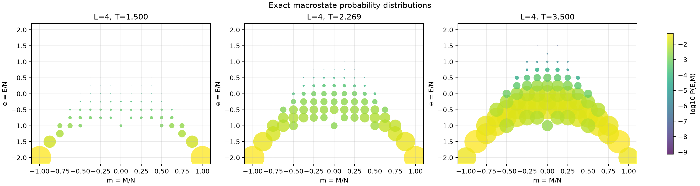
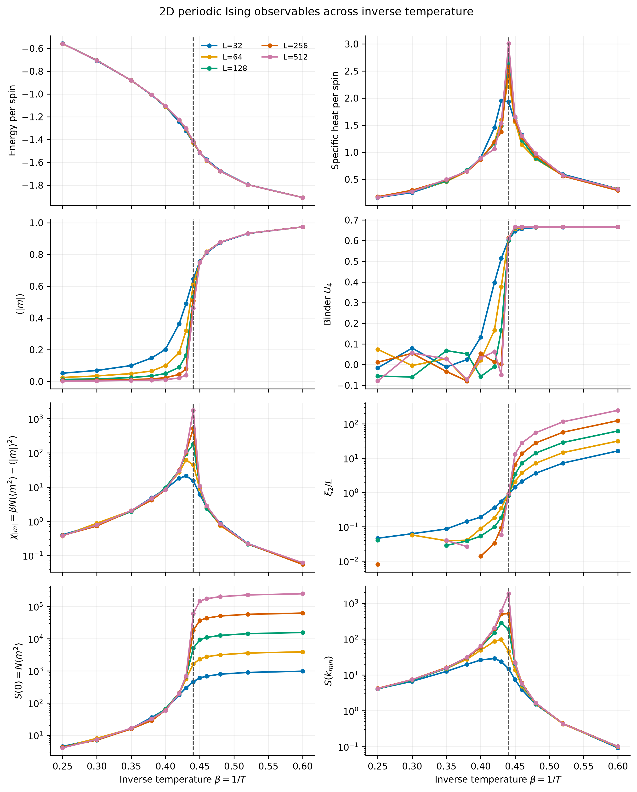
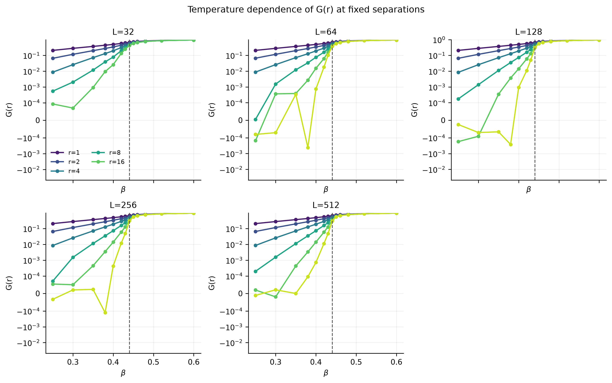
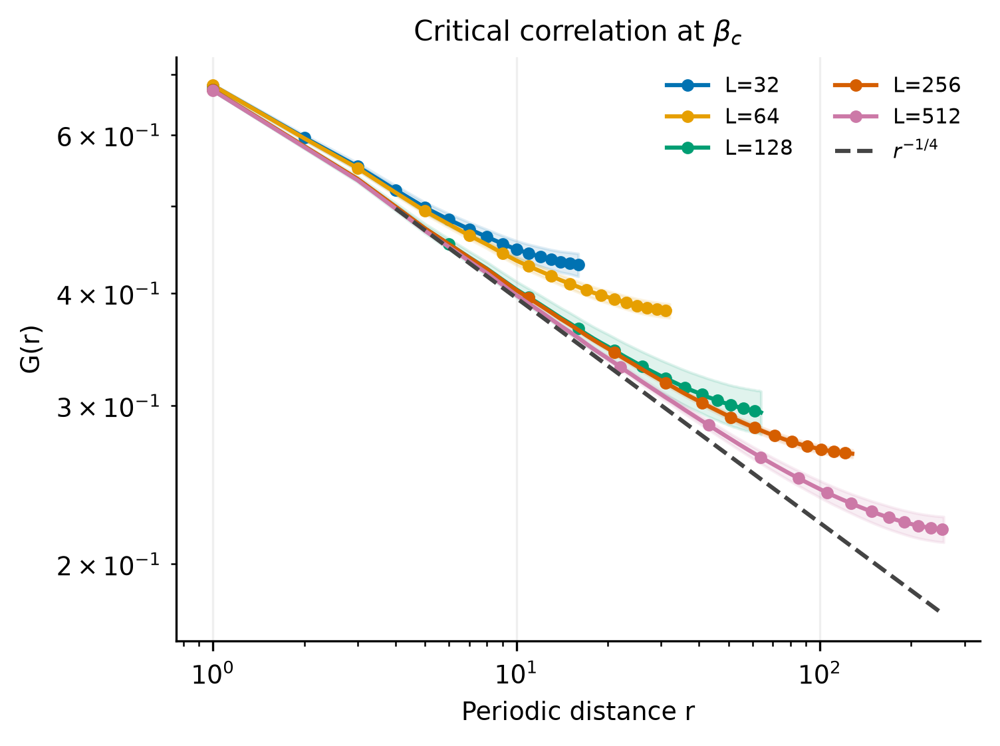

# 0. Ising 模型：黑白棋盘上的概率分布

Ising 模型最重要的出发点不是某一种特殊的黑白图案，而是**定义在所有黑白图案上的概率分布**。Hamiltonian 为每个构型赋予能量，逆温度 $\beta$ 再把能量转换成概率；能量、磁化、比热和关联函数等物理量，都是这个概率分布下的统计量。

本文考虑二维正方格、最近邻铁磁 Ising 模型。除非特别说明，均采用周期边界条件、零外场 $h=0$，并取自然单位 $k_B=J=1$。

## 1. 从黑白棋盘到构型空间

考虑一个边长为 $L$ 的方格，共有 $N=L^2$ 个格点。每个格点放置一个二值变量

$$
s_{x,y}\in\{-1,+1\},
$$

其中可以把 $s_{x,y}=+1$ 画成白色，把 $s_{x,y}=-1$ 画成黑色。一张完整的黑白棋盘就是一个构型

$$
\mathbf{s}=\{s_{x,y}\}_{x,y=0}^{L-1}.
$$

固定 $L$ 后，所有可能构型组成有限集合

$$
\Omega_L=\{-1,+1\}^{L^2},
\qquad
|\Omega_L|=2^{L^2}.
$$

因此，Ising 模型可以被看作一个离散概率模型：样本空间是 $\Omega_L$，随机变量是一整张黑白棋盘，而不是某一个孤立格点。模型要回答的问题是：在给定 $L$ 和 $\beta$ 后，每张棋盘出现的概率是多少？

## 2. Hamiltonian 如何决定构型概率

二维最近邻 Ising 模型的 Hamiltonian 为

$$
H_L(\mathbf{s})
=-J\sum_{\langle i,j\rangle}s_i s_j-h\sum_i s_i.
$$

在周期方格上，也可以把相互作用项明确写成

$$
H_L(\mathbf{s})
=-J\sum_{x,y}
\left(s_{x,y}s_{x+1,y}+s_{x,y}s_{x,y+1}\right)
-h\sum_{x,y}s_{x,y},
$$

其中坐标按照 $L$ 取模，每条最近邻键只计算一次。当 $J>0$ 时，相邻格点同色贡献 $-J$，异色贡献 $+J$，所以低能构型倾向于形成同色团簇；外场 $h$ 则控制系统整体偏爱 $+1$ 还是 $-1$。

Hamiltonian 本身只是能量评分。真正把它变成概率分布的是 Boltzmann 权重：

$$
p_{L,\beta}(\mathbf{s})
=\frac{e^{-\beta H_L(\mathbf{s})}}{Z_L(\beta)},
$$

其中配分函数

$$
Z_L(\beta)
=\sum_{\mathbf{s}\in\Omega_L}e^{-\beta H_L(\mathbf{s})}
$$

保证所有构型的概率之和等于 $1$。这里

$$
\beta=\frac{1}{k_BT}
$$

是**逆温度**：增大 $\beta$ 等价于降低温度，而不是升高温度。在本文采用的 $k_B=1$ 单位下，$T=1/\beta$。

对于任意两个构型 $\mathbf{s}$ 和 $\mathbf{s}'$，概率比为

$$
\frac{p_{L,\beta}(\mathbf{s}')}{p_{L,\beta}(\mathbf{s})}
=e^{-\beta[H_L(\mathbf{s}')-H_L(\mathbf{s})]}.
$$

这个式子直接说明了 $\beta$ 的作用：当 $\beta$ 很小时，能量差不重要；当 $\beta$ 很大时，高能构型会受到强烈压制。特别地，$\beta=0$ 时所有 $2^{L^2}$ 个构型等概率；当 $\beta\to\infty$ 且 $h=0$ 时，概率主要集中到全白和全黑两个铁磁基态上。

下图来自 $L=4$ 周期系统的精确枚举。每个点代表一个由能量密度 $e=E/N$ 和磁化密度 $m=M/N$ 标记的宏观态，点的大小和颜色表示总概率。低温时概率集中在 $m\approx\pm1$ 的有序态；温度升高后，概率逐渐分散到数量众多的无序构型中。

这里还体现了一个关键竞争：单个低能构型有更大的 Boltzmann 权重，但某类较高能构型可能具有巨大的数量优势。临界现象正是能量偏好与构型数量竞争的宏观结果。

## 3. 概率分布上的物理量

任意依赖构型的量 $A(\mathbf{s})$ 都是一个随机变量，其热平均为

$$
\langle A\rangle_{L,\beta}
=\sum_{\mathbf{s}\in\Omega_L}
A(\mathbf{s})p_{L,\beta}(\mathbf{s}).
$$

因此，研究 Ising 模型就是研究这个分布下不同随机变量的均值、方差和空间协方差。

### 3.1 能量与磁化

总能量和总磁化分别为

$$
E(\mathbf{s})=H_L(\mathbf{s}),
\qquad
M(\mathbf{s})=\sum_i s_i.
$$

常用的强度量是每格点平均能量和绝对磁化：

$$
e_L(\beta)=\frac{\langle E\rangle}{N},
\qquad
m_{\mathrm{abs},L}(\beta)=\frac{\langle|M|\rangle}{N}.
$$

零外场下，$\mathbf{s}$ 与 $-\mathbf{s}$ 具有相同能量和概率。对任意有限 $L$，正负磁化会严格抵消，因此

$$
\langle M\rangle_{L,\beta}=0.
$$

这并不表示低温系统没有有序，而是说明有限系统没有自动选择正、负两个方向中的一个。描述有限系统的有序程度时，应使用 $\langle|M|\rangle$、$\langle M^2\rangle$ 或磁化分布，而不能只看 $\langle M\rangle$。

### 3.2 涨落、响应函数与 Binder 累积量

能量和磁化的涨落定义了每格点比热与磁化率：

$$
c_L(\beta)
=\frac{\beta^2}{N}
\left(\langle E^2\rangle-\langle E\rangle^2\right),
$$

$$
\chi_L(\beta)
=\frac{\beta}{N}
\left(\langle M^2\rangle-\langle M\rangle^2\right).
$$

有限零场系统在低温下会在正、负磁化峰之间切换。为了更直观地显示临界区域，也常画

$$
\chi_{|m|,L}(\beta)
=\frac{\beta}{N}
\left(\langle M^2\rangle-\langle|M|\rangle^2\right).
$$

Binder 累积量

$$
U_{4,L}(\beta)
=1-\frac{\langle M^4\rangle}{3\langle M^2\rangle^2}
$$

刻画磁化分布的形状。它在无序相附近趋近 $0$，在理想双峰有序分布中趋近 $2/3$，并且适合比较不同尺寸的临界区域。

## 4. 固定 $L$，观察物理量随 $\beta$ 的变化

当 $L$ 固定时，Hamiltonian 决定每个构型的能量表；改变 $\beta$ 并不会改变这张表，只会重新分配所有构型的概率。于是在一系列 $\beta$ 上重复计算 $\langle A\rangle_{L,\beta}$，便得到物理量的逆温度扫描曲线。

图中虚线为无限二维正方格模型的精确临界逆温度。随着 $\beta$ 增大，也就是温度降低，可以观察到：

- 能量密度变得更负，因为同向最近邻逐渐增多；
- $\langle|m|\rangle$ 从接近 $0$ 快速上升，系统由无序走向有序；
- 比热和 $\chi_{|m|}$ 在临界区域出现峰值，表示能量和磁化涨落增强；
- $U_4$ 从无序相附近的 $0$ 过渡到有序相的 $2/3$；
- 系统越大，交叉区域越窄，峰值通常越高，有限尺寸结果越接近热力学极限。

图中下方的 $S(0)=N\langle m^2\rangle$ 是零波数结构因子，$\xi_2/L$ 是无量纲二阶矩关联长度。它们从动量空间和长度尺度两个角度描述长程关联的建立。

## 5. 关联函数：一个格点能影响多远

磁化描述整张棋盘是否有序，却不能区分“小团簇很多”和“整个系统形成大团簇”。为此定义平移平均后的两点关联函数

$$
G_L(\mathbf{r};\beta)
=\frac{1}{N}\sum_i
\left\langle s_i s_{i+\mathbf{r}}\right\rangle_{L,\beta}.
$$

因为 $s_i s_j$ 在两个格点同色时为 $+1$、异色时为 $-1$，所以 $G_L(\mathbf{r};\beta)$ 越大，表示相距 $\mathbf{r}$ 的两个格点越倾向于同色。定义连通关联函数

$$
C_L(\mathbf{r};\beta)
=G_L(\mathbf{r};\beta)
-\langle s_i\rangle\langle s_{i+\mathbf{r}}\rangle.
$$

在平移不变系统中，磁化率正是全空间连通关联的总和：

$$
\chi_L(\beta)
=\beta\sum_{\mathbf{r}}C_L(\mathbf{r};\beta).
$$

所以临界附近磁化率变大，可以理解为越来越多相距很远的格点开始共同波动。

固定距离 $r$ 后，$G_L(r;\beta)$ 通常随 $\beta$ 增大而增强。短距离关联在较高温度下已经可见，而长距离关联要到更靠近 $\beta_c$ 时才迅速建立；这正是关联长度增长的直接表现。高温侧远距离关联的微小负值来自有限 Monte Carlo 样本噪声，不应解释为反铁磁振荡。

在远离临界点的无序相，连通关联大致按指数衰减：

$$
C(r;\beta)\sim e^{-r/\xi(\beta)},
$$

其中 $\xi(\beta)$ 是关联长度。低温有序相中，普通关联函数在长距离处趋向自发磁化的平方，

$$
G(r;\beta)\longrightarrow m_{\mathrm{sp}}(\beta)^2,
$$

而扣除这个平台后的单相连通关联仍在有限关联长度上衰减。

## 6. 临界温度与热力学极限中的奇异性

对于固定且有限的 $L$，配分函数 $Z_L(\beta)$ 只是有限个正指数函数之和。因此在实数 $\beta$ 上，$Z_L(\beta)$、$\log Z_L(\beta)$ 及其导出的观测量都是光滑函数。有限棋盘上不会出现严格的突变或发散，只会出现圆滑的快速变化、有限峰值和依赖尺寸的赝临界点。

真正的相变出现在热力学极限。定义自由能密度

$$
f(\beta)
=-\lim_{L\to\infty}\frac{1}{\beta L^2}\log Z_L(\beta).
$$

如果这个极限函数在某个 $\beta$ 处失去解析性，就称该点为临界点。二维正方格、零外场、最近邻铁磁 Ising 模型的精确临界逆温度为

$$
\beta_c J
=\frac{1}{2}\log(1+\sqrt{2}),
$$

取 $J=1$ 时

$$
\beta_c\approx0.4406867935,
\qquad
T_c=\frac{1}{\beta_c}\approx2.269185314.
$$

于是 $\beta<\beta_c$ 是高温无序相，$\beta>\beta_c$ 是低温有序相。在无限系统中，自发磁化必须按先取体积极限、再撤去外场的顺序定义：

$$
m_{\mathrm{sp}}(\beta)
=\lim_{h\to0^+}\lim_{L\to\infty}
\frac{\langle M\rangle_{L,\beta,h}}{L^2}.
$$

二维模型的精确结果为

$$
m_{\mathrm{sp}}(\beta)
=
\begin{cases}
0, & \beta\leq\beta_c,\\
\left[1-\sinh^{-4}(2\beta J)\right]^{1/8}, & \beta>\beta_c.
\end{cases}
$$

在临界点附近，几种典型奇异行为为

$$
c(\beta)\sim-\log|\beta-\beta_c|,
$$

$$
\chi(\beta)\sim|\beta-\beta_c|^{-7/4},
$$

$$
\xi(\beta)\sim|\beta-\beta_c|^{-1}.
$$

临界点处 $\xi\to\infty$，系统不再具有单一的有限特征长度，关联函数由指数衰减转为幂律衰减：

$$
C(r;\beta_c)\sim r^{-1/4}.
$$

图中的虚线是精确临界幂律 $r^{-1/4}$。有限周期方格的关联长度受到 $L$ 限制，因此曲线在接近系统尺度时会偏离无限平面的幂律；随着 $L$ 增大，能够观察到的近似临界标度区间也随之扩大。

有限尺寸与热力学极限的差别可以概括为：

| 物理量 | 固定有限 $L$ | $L\to\infty$ |
|---|---|---|
| 自由能 | 关于 $\beta$ 光滑 | 在 $\beta_c$ 非解析 |
| $\langle|m|\rangle$ | 圆滑交叉 | 出现自发磁化和临界幂律 |
| 比热 | 有限的圆滑峰 | 在 $\beta_c$ 对数发散 |
| 磁化率 | 有限且依赖 $L$ 的峰 | 在 $\beta_c$ 幂律发散 |
| 关联长度 | 最大受系统尺寸限制 | 在 $\beta_c$ 发散 |
| 关联函数 | 最远只能看到 $O(L)$ | 临界点在任意大尺度呈幂律 |

对二维 Ising 模型，临界有限尺寸标度还预言

$$
c_L^{\max}\sim\log L,
\qquad
\chi_L(\beta_c)\sim L^{7/4},
\qquad
\langle|m|\rangle_{\beta_c}\sim L^{-1/8}.
$$

因此，不能根据单个有限 $L$ 的一条峰值曲线宣称看到了数学奇点；需要比较多个 $L$，研究峰高、峰位置、Binder 交点和关联函数的有限尺寸标度。

## 7. 为什么选择 Ising 模型研究 Transformer

选择 Ising 模型，并不是因为它只是一个容易生成的“黑白图片数据集”，而是因为它为生成模型提供了一个**简单、可控且有明确理论答案的尺度外推实验场**。

首先，每个格点只有 $\pm1$ 两种状态，天然适合使用 masked Transformer 或 discrete diffusion：训练时随机遮盖一部分自旋，让模型根据其余格点恢复被遮盖的内容；生成时则可以从全 mask 状态逐步还原出完整构型。与此同时，我们可以用 Monte Carlo 在指定 $L$ 和 $\beta$ 下产生大量可靠样本，并用能量、磁化、结构因子和关联函数检验生成分布，而不必只凭肉眼判断图片是否相似。

更重要的是，Ising 模型具有清楚的长程结构。在非临界点，关联函数具有有限关联长度并近似指数衰减：

$$
C(r)\sim e^{-r/\xi}.
$$

在临界点，系统没有单一的特征长度，二维 Ising 关联函数变为幂律：

$$
C(r)\sim r^{-1/4}.
$$

因此，临界 Ising 数据不仅要求模型学会局部相邻自旋的规律，还要求它同时协调许多不同距离上的统计关系。这使它特别适合检验 Transformer 是否真正学到了跨尺度结构。

我们的核心问题是：**Transformer 学到的是 Ising 概率分布背后的尺度规律，还是只在训练窗口内拟合了同分布统计？** 一个模型能够在训练过的 $50\times50$ 或 $100\times100$ 方格上生成看似正确的样本，并不足以回答这个问题。更严格的实验是：

1. 先从较大的临界 Monte Carlo 场中裁剪出一种或多种尺寸的训练样本；
2. 在这些较小窗口上训练 masked Transformer，并使用二维位置编码使模型在工程上能够处理更大的 token grid；
3. 冻结模型，在大于训练尺寸的方格上直接生成构型；
4. 检查训练时未见过的距离上，生成样本是否仍保持正确的 $C(r)\sim r^{-1/4}$，以及结构因子、Binder 累积量等统计量是否与 Monte Carlo 参考一致。

这里必须区分两种能力：模型能够在更大的网格上完成前向计算和生成，只说明它实现了**形状或 context 的扩展**；只有当输出在训练范围之外仍保持正确的长程关联和临界标度时，才能说明它具有**物理统计意义上的尺度外推**。如果关联曲线在训练窗口之外截断、变成错误的指数衰减或出现其他系统偏差，就说明模型主要学到了有限窗口内的分布，而没有可靠地外推临界物理。

在此基础上还可以研究更困难的组合泛化。例如，让模型在非临界温度见过大尺寸样本、在临界温度只见过小尺寸样本，再测试它能否生成大尺寸临界场；也可以混合多个温度和尺寸进行训练，检验模型能否同时区分指数关联与幂律关联。若训练包含多个温度，需要把 $\beta$ 作为条件输入；若只研究固定临界温度，则不必额外注入温度信息。

最后，可以分析 attention 权重随空间距离的变化，比较它在临界点是否比非临界点具有更长尾的结构。不过 attention 形状只能作为机制线索，不能单独证明模型学会了物理规律；主要判据仍应是生成样本的关联函数及其在未见尺度上的外推表现。

## 8. 为什么下一步需要 Monte Carlo

以上定义都是精确的，但直接计算它们需要对 $2^{L^2}$ 个构型求和。$L=4$ 时只有 $65\,536$ 个状态，可以完整枚举；$L=8$ 时已经有

$$
2^{64}\approx1.84\times10^{19}
$$

个状态，更大的系统更不可能穷举。困难不在于计算某一个构型的 Hamiltonian，而在于构型总数随面积指数增长。

这就引出第 1 部分的任务：不再遍历所有构型，而是使用 Monte Carlo 方法从 $p_{L,\beta}(\mathbf{s})$ 中抽取具有代表性的构型，再用样本平均估计 $\langle A\rangle_{L,\beta}$。无论采用哪一种采样算法，其目标概率分布始终是本节定义的 Boltzmann 分布。

## 小结

1. 固定 $L$ 后，Ising 模型是在全部 $2^{L^2}$ 张黑白棋盘上定义的概率分布。
2. Hamiltonian 给构型赋予能量，$\beta$ 通过 Boltzmann 因子把能量映射为概率；改变 $\beta$ 就是在重新加权同一构型空间。
3. 能量、磁化、比热、磁化率和关联函数都是该分布下的期望或涨落，可以在固定 $L$ 下研究它们随 $\beta$ 的连续变化。
4. 固定有限 $L$ 时所有曲线都光滑；只有在 $L\to\infty$ 的热力学极限中，$\beta_c$ 处才会出现自由能非解析、响应函数发散和关联长度发散等真正的临界现象。
5. 临界 Ising 模型提供了可精确检验的尺度律，可用于区分 Transformer 的训练窗口内拟合能力与训练窗口外的长程物理外推能力。
