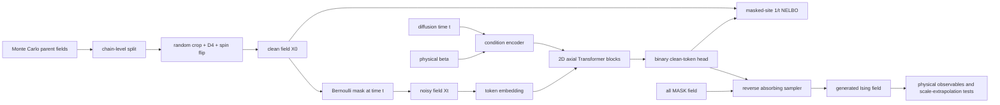

# 2. Model Design：用于 Ising 尺度外推的离散扩散 Transformer

本文设计一个同时覆盖训练与推理的 Ising 生成模型。它以 `nano_world_model/block_diffusion.py` 的 absorbing-state block diffusion 为目标函数基础，但针对二维 Ising 场做三项关键调整：去掉视频任务才需要的时间因果 clean/noisy 双流，加入显式的扩散时间与物理逆温度条件，并用可扩展的二维轴向 attention 代替对全部 $W^2$ 个格点做 dense attention。

模型的研究目标不是“生成看起来像 Ising 的黑白纹理”，而是检验 Transformer 能否从有限训练窗口中学到正确的统计分布，并把临界长程关联外推到训练时未见的距离。

## 1. 一页式设计结论

| 项目 | 设计 |
|---|---|
| 干净数据 | Monte Carlo 生成的 $X_0\in\{-1,+1\}^{H\times W}$ |
| 网络输入 | 部分 mask 的格点 $X_t$、扩散时间 $t$、可选物理条件 $\beta$ |
| 词表 | `0` 表示 $-1$，`1` 表示 $+1$，`2` 表示 `[MASK]` |
| 主干 | 双向、非因果的二维轴向 Transformer，使用 axial 2D RoPE |
| 网络输出 | 每个格点属于 $-1$ 或 $+1$ 的两个 clean-token logits，形状为 $[B,H,W,2]$ |
| 训练目标 | Bernoulli absorbing corruption 下的 fixed-site、$1/t$ 加权 NELBO |
| 推理方法 | 从全 `[MASK]` 开始，按 reverse schedule 多步、单调地揭示自旋 |
| 尺度外推 | 训练不注入目标尺寸，不使用 learned absolute position；冻结模型后直接改变 $H,W$ |
| 主要判据 | 能量、磁化、Binder、$G(r)$、$G_c(r)$、结构因子及未见距离上的临界指数 |
| Infra 接口 | 自定义 `IsingDiffusionSystem.loss(batch)`，复用 nanoinfra 的 Trainer、checkpoint 与 DDP |

端到端数据流如下：



## 2. 从 `block_diffusion.py` 继承什么、修改什么

### 2.1 直接保留的设计

`block_diffusion.py` 中以下机制是本方案的基础：

1. **Absorbing-state corruption**：每个 clean token 以概率 $t$ 独立替换成 `[MASK]`，mask 是吸收态。
2. **每个样本独立采样噪声强度**：$t\sim U[t_{\min},t_{\max}]$，使一次训练覆盖从轻微破坏到几乎全 mask 的状态。
3. **Fixed-token denominator 与 $1/t$ 权重**：loss 除以固定的预测位置数，而不是实际 mask 数，得到 MDLM 线性 schedule 对应的 NELBO 估计。
4. **噪声由数据身份确定**：noise seed 与样本而非 step 或 rank 绑定，使 resume 和 DDP 对照可复现。
5. **固定验证尺子**：固定 validation 样本、固定 $t$ 网格、固定 mask RNG，确保不同 checkpoint 的指标可比。
6. **Objective 放进 System**：让项目实现 `loss(batch)`，而不修改通用 Trainer。
7. **先选位置再算 loss**：只在 masked site 上计算交叉熵，避免无用监督和中间张量。

### 2.2 Ising 任务需要的调整

| 视频 block diffusion | Ising 设计 | 原因 |
|---|---|---|
| 一个 row 包含多个时间 frame block | 一个样本就是一个二维自旋场 | Ising 样本没有“过去帧预测未来帧”的因果结构 |
| `[clean row \| noisy row]` 双流 | 只输入 noisy field $X_t$ | 视频双流用于给未来 block 提供 clean prefix；Ising 中输入 clean copy 会造成标签泄漏 |
| clean prefix + block 内双向 attention | 全场双向二维 attention | 每个被 mask 格点都应使用当前可见的全部空间上下文 |
| 镜像一维 RoPE | 行列分离的 axial 2D RoPE | raster 一维距离不等于二维物理距离 |
| 大视频词表 head | 两类 clean-spin head | `[MASK]` 只属于 forward corruption，不是生成目标 |
| 原文件只定义训练与 validation loss | 增加 schedule-consistent reverse sampler | 完整生成必须从全 mask 反演到 clean field |
| dense token attention | 共享参数的行/列轴向 attention | 将大网格复杂度从 $O(W^4)$ 降低到 $O(W^3)$ |

这里不复用原始双流的最根本原因是：`block_diffusion.py` 中 noisy block $k$ 可以读取的是它之前的 clean block，而明确不能读取自己的 clean block。单张 Ising 场不存在合法的 clean temporal prefix，因此最干净的实现就是单 noisy stream。

## 3. 输入、条件与输出契约

### 3.1 干净数据输入

一条原始样本由以下字段定义：

$$
X_0\in\{-1,+1\}^{H\times W},
\qquad
\beta\in\mathbb R_{>0}.
$$

训练 baseline 时可固定 $\beta=\beta_c$；研究跨温度泛化时，同一架构接收多个 $\beta$。数据记录还必须包含 `source_run`、Monte Carlo `chain_id`、`parent_id`、seed 和 crop 坐标，用于数据去重、无泄漏划分和结果追踪。

网络内部使用以下 token 映射：

$$
-1\mapsto0,
\qquad
+1\mapsto1,
\qquad
\mathrm{MASK}\mapsto2.
$$

### 3.2 扩散输入

对每个样本采样

$$
t\sim U(t_{\min},1),
$$

并对每个位置独立采样

$$
M_i\sim\operatorname{Bernoulli}(t).
$$

带噪输入为

$$
(X_t)_i=
\begin{cases}
\mathrm{MASK}, & M_i=1,\\
(X_0)_i, & M_i=0.
\end{cases}
$$

真正进入网络的是 $(X_t,t,\beta)$；$X_0$ 只作为监督目标，绝不能进入 attention 可见范围。

建议 dataloader 输出以下 batch dict：

| key | dtype 与形状 | 含义 |
|---|---|---|
| `clean_tokens` | `int64 [B,H,W]` | 值为 $0/1$ 的干净自旋 |
| `beta` | `float32 [B]` | 物理逆温度；固定温度模型也保留在 manifest 中 |
| `sample_ids` | `int64 [B]` | 可复现的逻辑样本身份 |
| `source_ids` | CPU metadata | chain、parent、crop 和增强来源 |
| `noise_seed` | scalar integer | 从该 microbatch 的逻辑样本身份稳定派生 |
| `state_dict` | dict | resumable sampler 的位置 |

同一 microbatch 内的 $H,W$ 必须相同，以获得静态 tensor shape 和稳定的编译性能；不同尺寸通过不同 microbatch 交替训练。

### 3.3 网络输出

网络返回

$$
\ell_\theta(X_t,t,\beta)
\in\mathbb R^{B\times H\times W\times2},
$$

最后一维是 clean spin $-1$ 和 $+1$ 的 logits。对应 posterior 为

$$
p_\theta((X_0)_i=a\mid X_t,t,\beta)
=\operatorname{softmax}(\ell_{\theta,i})_a,
\qquad a\in\{-1,+1\}.
$$

输出 head 不预测 `[MASK]`。训练时只读取 $M_i=1$ 的位置；推理时读取当前仍为 `[MASK]` 的位置。

### 3.4 最终推理输出

一次生成任务至少输出：

- `samples.npz`：$X\in\{-1,+1\}^{B\times H\times W}$；
- `manifest.json`：checkpoint、git commit、$\beta$、$H,W$、采样步数、schedule、随机种子和耗时；
- `sampling_trace.jsonl`：每一步剩余 mask 比例、平均 entropy 和 reveal 数量；
- 评估任务额外输出物理量表格与关联函数数组。

## 4. 模型架构

### 4.1 推荐 baseline 配置

| 参数 | 推荐起点 |
|---|---:|
| clean vocabulary | $2$ |
| input vocabulary | $3$，包含 `[MASK]` |
| Transformer blocks | $8$ |
| embedding dimension | $256$ |
| attention heads | $8$ |
| head dimension | $32$ |
| MLP ratio | $4$ |
| normalization | pre-RMSNorm |
| QK normalization | 开启 |
| attention | shared row/column axial attention |
| position | raw integer axial 2D RoPE |
| dropout | $0$ 起步；小数据时单独消融 $0.05$ |
| parameter dtype | BF16 计算，FP32 optimizer state 与 loss reduction |

这些值是首轮工程起点，不是预先宣称的最优超参数。应先用较小的 $4$ 层、$d=128$ 配置做 correctness smoke test，再扩到正式配置。

### 4.2 Token 与条件编码

token embedding 为

$$
h_i^{(0)}=E_{\mathrm{token}}[(X_t)_i].
$$

扩散时间和物理逆温度分别经过 Fourier features，再由小型 MLP 合并：

$$
c
=\operatorname{MLP}
\left(
\phi_t(t)\,\Vert\,
\phi_\beta\left(\frac{\beta-\beta_c}{\beta_c}\right)
\right).
$$

其中 $\Vert$ 表示拼接。条件 $c$ 通过每层的 adaptive normalization scale、shift 和 residual gate 注入，而不是作为额外空间 token。这样所有格点共享同一物理条件，也不会让一个 condition token 成为人造的长程通信瓶颈。

固定临界温度 baseline 可以关闭 $\phi_\beta$ 分支，只保留 $t$ 条件。多温度模型再启用 $\beta$ 条件；不把 $H,W$ 或目标尺寸输入条件编码器，因为 baseline 正要检验模型能否在没有尺寸提示和目标尺寸适配的情况下外推。

必须把 **sampled $t$** 而不是实际 mask fraction 输入模型。实际 mask 数是 Bernoulli 随机量，而 reverse kernel 的时间变量对应 forward schedule 的 $t$。

### 4.3 共享参数的二维轴向 attention

若把 $N=W^2$ 个格点直接送入 dense attention，attention 对数为

$$
N^2=W^4.
$$

$W=256$ 时单层就有约 $4.3\times10^9$ 个 query-key 对，位置编码虽然允许扩展，计算却不可行。因此主架构使用轴向 attention：

1. row attention：把 $B\times H$ 行视为长度 $W$ 的 batch；
2. column attention：把 $B\times W$ 列视为长度 $H$ 的 batch；
3. 两个方向共享 QKV 和 output projection 参数，并将结果相加。

对第 $l$ 层，核心更新为

$$
u=\operatorname{AdaNorm}(h^{(l)},c),
$$

$$
a
=\frac{1}{\sqrt2}
\left[
\operatorname{Attn}_{\mathrm{row}}(u)
+\operatorname{Attn}_{\mathrm{col}}(u)
\right],
$$

$$
\tilde h
=h^{(l)}+g_{\mathrm{attn}}(c)\odot a,
$$

$$
h^{(l+1)}
=\tilde h
+g_{\mathrm{mlp}}(c)\odot
\operatorname{MLP}(\operatorname{AdaNorm}(\tilde h,c)).
$$

residual gate 在初始化时接近 $0$，避免条件化深层网络在训练初期不稳定。行列参数共享并配合 $D_4$ 数据增强，可减少人为的横纵方向差异；评估仍必须分别报告 axis 与 diagonal correlation，以识别残余各向异性。

轴向 attention 的复杂度为

$$
O\left(BDHW(H+W)\right),
$$

对正方格即 $O(BDW^3)$。一层中任意两个不同行、不同列的格点不能直接互相 attention，但经过两层即可通过行列交点交换信息，因此 $8$ 层足以建立全局通信路径。

### 4.4 二维 RoPE 与尺度外推约束

row attention 只对列坐标施加一维 RoPE，column attention 只对行坐标施加同一组频率的 RoPE。模型不包含 learned absolute-position table，也不在初始化时锁定最大 $H,W$；推理时根据目标网格动态生成坐标和 cos/sin 表。

baseline 使用原始整数坐标，不做 NTK scaling、YaRN、坐标归一化或目标尺寸插值。原因是这些方法本身就是尺度外推干预，必须在冻结 baseline 测量之后再作为独立实验比较，不能悄悄混入主结论。

### 4.5 Binary clean-token head

最后经过 RMSNorm 和无 bias 线性层：

$$
\ell_i=W_{\mathrm{out}}\operatorname{RMSNorm}(h_i)\in\mathbb R^2.
$$

视频模型的大词表需要编译融合 `_head_ce` 来避免巨大 $[M,V]$ logits；Ising 的 $V=2$，因此不需要为显存引入同等复杂的 fused head。实现仍应先切出 masked hidden states，再用 FP32 logits 计算 CE，以保持目标语义清楚并减少无用计算。

## 5. 训练设计

### 5.1 数据划分与 crop

必须先按独立 Monte Carlo chain 划分 train、validation 和 test，再从各自 parent field 中裁 crop。不能先产生大量重叠 crop 再随机划分，否则相邻 crop 会把同一父构型信息泄漏到不同 split。

建议 baseline 使用：

- parent field：$L=512$ 或更大；
- 训练宽度：$W\in\{32,48,64\}$；
- 训练增强：方格 $D_4$ 的旋转/反射，以及概率 $1/2$ 的全局 spin flip；
- validation/test：固定、可复现、non-wrapping crop；
- 不使用 patch shuffle 训练；它只作为破坏长程结构的负控制。

若直接训练完整周期场，则数据、能量和关联估计都必须使用周期边界；若训练来自大场的 crop，则主评估应使用开放边界估计。两套定义不能混用。

### 5.2 Forward corruption 与 NELBO

默认取

$$
t_{\min}=0.2,
\qquad
t_{\max}=1.
$$

$t$ 不取到 $0$，因为 $1/t$ 会使轻噪声区域具有很大的梯度方差。严格按 Bernoulli corruption 采样，不额外强制全 mask，也不强制每个样本至少有一个 mask；偶然的空 mask 样本在 fixed-site NELBO 中贡献 $0$。

令

$$
\ell_i
=-\log p_\theta((X_0)_i\mid X_t,t,\beta),
$$

训练 loss 为

$$
\mathcal L_{\mathrm{NELBO}}
=\frac{1}{B}
\sum_{b=1}^{B}
\frac{1}{N_b}
\sum_{i=1}^{N_b}
\frac{M_{b,i}}{t_b}\ell_{b,i}.
$$

这里分母是固定的 $N_b=H_bW_b$，不是该样本实际 mask 数。因为每个 microbatch 只有一种宽度，张量内所有 $N_b$ 相同；跨宽度时先得到每个样本的 per-site loss，再在全局 batch 上平均，避免较大窗口仅因 token 更多而自动获得更大权重。

### 5.3 单个训练 step

```text
读取一个同尺寸 microbatch: clean_tokens, beta, sample_ids
由 sample_ids 派生 noise_seed
每个样本采样 t ~ Uniform(t_min, 1)
每个格点采样 M_i ~ Bernoulli(t)
构造 X_t：masked 位置替换为 MASK
logits = model(X_t, t, beta)
只选 masked positions 计算 binary CE
乘以 1/t，并除以每个样本固定的 H*W
对 gradient-accumulation microbatches 求平均
backward -> gradient clip -> AdamW step -> scheduler step
```

### 5.4 多尺寸 batch 调度

第一版 baseline 对所有训练宽度使用同一个 `device_batch_size` 和固定 gradient accumulation，batch size 按最大训练宽度的显存需求确定。每个 optimizer step 先选定一个 $W$，该 step 的所有 accumulation microbatch 和所有 DDP rank 都使用这个 $W$。这种方案会让小宽度 step 的 GPU 利用率偏低，但可以原样复用 nanoinfra Trainer 的固定 batch accounting，且不同宽度获得相同的 step 权重，最适合作为可审计的基线。

吞吐优化版可以按近似固定的 site budget 选择每个宽度的 batch size：

$$
B_W
=\max\left(1,
\left\lfloor\frac{S_{\mathrm{micro}}}{W^2}\right\rfloor
\right).
$$

width schedule 仍由全局 optimizer step 和固定 seed 决定，使所有 DDP rank 在同一步使用相同 shape；各 rank 再读取不同样本。这样可以同时满足：

- 不同尺寸的计算量大致平衡；
- 每个已知宽度只有有限数量的 compile graph；
- checkpoint resume 后 width 序列完全一致；
- 改变 GPU 数量时仍可恢复逻辑训练进度。

但是，nanoinfra 当前通用 Trainer 使用配置中的固定 `device_batch_size × sequence_len` 推导 gradient accumulation 和 token accounting。动态 $B_W$ 不能只在 dataloader 中静默改变；它需要一个很薄的 site-aware Trainer adapter，根据 batch 提供的 `n_sites` 做 accumulation、loss scaling 和日志统计。这个 adapter 只处理训练单位，不接触 Ising objective。宽度采样应显式配置为均匀按 width、均匀按 site 或自定义概率，不能让 $B_W$ 无意中决定科学数据分布。

### 5.5 优化器与数值精度

建议首轮正式配置使用 AdamW：

| 参数 | 建议起点 |
|---|---:|
| learning rate | $1\times10^{-4}$ 到 $3\times10^{-4}$，通过短 sweep 选择 |
| betas | $(0.9,0.95)$ |
| weight decay | $0.01$ |
| warmup | 总 updates 的 $1\%$ 左右 |
| schedule | cosine decay 到初始值的 $10\%$ |
| gradient clip | global norm $1.0$ |
| autocast | BF16 |
| CE 与统计 reduction | FP32 |

embedding、主干和 output head 首先使用相同 learning rate。`nano_world_model` 已经表明 text-tuned 的 role-based 多 learning-rate 不一定适合离散视觉词表；Ising 词表极小，更没有直接沿用 text 默认值的理由。

### 5.6 验证与 checkpoint 选择

验证分成两个互不替代的尺子：

1. **Likelihood ruler**：固定 validation crop、固定 $t$ 网格和固定 mask RNG，报告 `val/nelbo`、各 $t$ 的 NELBO、masked CE 和 accuracy。
2. **Physical ruler**：周期性地生成固定数量样本，报告能量、磁化、Binder、关联函数和结构因子。

checkpoint 只按训练尺寸 validation NELBO 或预先声明的训练尺寸综合指标选择。目标外推尺寸不得参与选 checkpoint、调 sampling steps 或调 RoPE，否则 test context 已进入模型选择过程。

## 6. 推理设计

### 6.1 输入

一次推理请求为：

```text
checkpoint
target shape: B, H, W
physical beta
reverse steps K
time schedule
sampling temperature tau_sample
random seed
```

这里的 `sampling temperature` $\tau_{\mathrm{sample}}$ 只用于 softmax logits，不能与 Ising 物理温度 $T=1/\beta$ 混淆。确认性实验默认固定 $\tau_{\mathrm{sample}}=1$，不针对目标尺寸调参。

### 6.2 与 forward corruption 一致的反向过程

初始化

$$
X_{t_K}=\mathrm{MASK}^{H\times W},
\qquad
t_K=1.
$$

选择严格递减时间网格

$$
1=t_K>t_{K-1}>\cdots>t_0=0.
$$

从当前 $t$ 移动到 $s<t$ 时，对每个仍为 mask 的格点：

1. 计算 $p_\theta(X_0\mid X_t,t,\beta)$；
2. 从 binary posterior 采样一个候选自旋；
3. 以概率

   $$
   p_{\mathrm{reveal}}=1-\frac{s}{t}
   $$

   揭示该位置；
4. 已揭示位置永久保持不变。

最后一步 $s=0$ 时揭示所有剩余位置。推荐先使用 $K=64$ 的 cosine time grid 作为质量 baseline，再预注册地比较 $K\in\{16,32,64,128\}$ 的速度—质量曲线。

```text
tokens = all MASK
for current_t, next_t in reverse_time_grid:
    logits = model(tokens, current_t, beta)
    proposals = sample_softmax(logits / tau_sample)
    reveal ~ Bernoulli(1 - next_t/current_t) on currently masked sites
    tokens[reveal] = proposals[reveal]
assert no MASK remains
return map {0,1} -> {-1,+1}
```

MaskGIT 的 confidence top-k sampler 可以作为速度对照，但它不是上述 forward schedule 的直接反向核，不能在主实验中与 absorbing sampler 混用后仍宣称只改变了模型尺度。

### 6.3 大尺寸推理

推理时动态构造 $H,W$ 对应的 axial RoPE，并直接复用冻结权重。禁止把大网格切成彼此独立的小 tile 生成，因为这样会人为截断研究所关心的长程关联。

每个 target width 使用预先确定的 batch size。记录以下两类结果：

- 工程结果：是否 OOM、每步耗时、总耗时、峰值显存；
- 物理结果：生成分布相对独立 Monte Carlo 参考的误差。

“可以在 $W=256$ 上运行”只说明 shape/context execution 成功，不说明物理尺度外推成功。

## 7. 我们用该模型研究什么能力

### 7.1 Stage A：训练尺度内生成

在 $W\in\{32,48,64\}$ 上训练并生成，先确认模型不仅恢复局部能量，还能恢复训练窗口内的 $G(r)$ 和 $G_c(r)$。独立 MC-vs-MC 给出有限样本噪声基线，patch-shuffle 给出“局部纹理相似但长程结构错误”的负控制。

### 7.2 Stage B：冻结模型的直接 context 外推

冻结 Stage A checkpoint、采样器、步数、RoPE 和所有超参数，在

$$
W\in\{64,96,128,192,256\}
$$

上直接生成。若训练最大宽度为 $64$，可保守定义已见半径

$$
R_{\mathrm{seen}}=32,
$$

并只在

$$
R_{\mathrm{seen}}<r\leq\left\lfloor\frac{W}{4}\right\rfloor
$$

评价未见距离尾部。按这个定义，$W=96,128$ 主要是工程和过渡 probe，$W=192,256$ 才有非空的确认性 unseen tail。

临界点的核心问题是生成关联能否在 unseen tail 中继续满足

$$
G_c(r)\propto r^{-1/4},
$$

而不是在训练半径外变平、截断或错误地转为指数衰减。

### 7.3 Stage C：跨温度与跨尺度组合泛化

在完成中立的 Stage B baseline 后，可启用 $\beta$ 条件并构造以下实验：

- 多个非临界温度的大窗口 + 临界点的小窗口；
- 测试临界点的大窗口；
- 检验模型能否同时识别非临界的指数衰减与临界的幂律衰减。

这个实验比纯尺寸外推更难，因为模型必须组合“温度决定关联形式”和“尺寸决定可观察距离”两种规律。

### 7.4 Attention 机制分析

可以在少量样本上记录 attention 的径向平均、各 head 的距离分布及层间变化，并比较临界与非临界温度。由于主模型使用 axial attention，应分别记录 row 和 column head，并检查方向一致性。

attention map 只作为机制线索。判断模型是否学到物理分布的主要证据始终来自输出样本的 $G(r)$、$G_c(r)$ 和低波数结构，而不是 attention 曲线看起来像幂律。

## 8. 物理评估设计

每个宽度都应将 model、独立 MC-A 和独立 MC-B 放在相同样本量下比较。MC-A 是目标参考，MC-B-vs-MC-A 是自然噪声底。

### 8.1 标量分布

- 开放边界或周期边界能量，取决于数据协议；
- signed magnetization $m$；
- absolute magnetization $|m|$；
- Binder cumulant $U_4$；
- 可选 susceptibility 与二阶矩关联长度。

只看 raw $G(r)$ 会让全正/全负 mode collapse 伪装成长程有序，因此 signed $m$ 分布和 connected correlation 是强制指标。

### 8.2 空间统计

- radial $G(r)$ 与 $G_c(r)$；
- axis 与 diagonal correlation，检测轴向架构伪影；
- unseen-tail relative $L_2$ error；
- $\eta$ 拟合及拟合窗口敏感性；
- Hann taper 后的低波数 structure factor；
- patch-shuffle 负控制。

### 8.3 结论分级

| 结果 | 可以得出的结论 |
|---|---|
| 目标宽度 OOM | 工程 context limit |
| 能运行但尾部错误 | shape extrapolation 成功，物理 context extrapolation 失败 |
| 训练范围内正确 | in-distribution generation 通过，不能证明尺度外推 |
| unseen tail 接近 MC 且显著优于负控制 | 支持长程物理外推，但仍需多 seed 和置信区间 |

## 9. Infra 设计

### 9.1 建议代码结构

```text
ising_scale_diffusion/
├── configs/
│   ├── train_smoke.yaml
│   ├── train_critical.yaml
│   ├── sample_in_distribution.yaml
│   └── eval_context_extrapolation.yaml
├── src/ising_scale_diffusion/
│   ├── spec.py                 # protocol constants and derived geometry
│   ├── cache.py                # immutable MC parent-field cache
│   ├── dataset.py              # chain split, crop, augmentation, resumable loader
│   ├── model.py                # conditional axial Transformer
│   ├── objective.py            # Bernoulli corruption and 1/t NELBO
│   ├── system.py               # IsingDiffusionSystem.loss(batch)
│   ├── trainer.py              # optional site-aware adapter for dynamic B_W
│   ├── sampler.py              # absorbing reverse and optional MaskGIT baseline
│   ├── evaluator.py            # frozen NELBO and scheduled physical evaluation
│   ├── observables.py          # energy, m, Binder, correlation, structure factor
│   └── artifacts.py            # manifests, tables and sample serialization
├── scripts/
│   ├── build_cache.py
│   ├── train.py                # only assembly; generic Trainer executes
│   ├── sample.py
│   └── evaluate_extrapolation.py
└── tests/
    ├── test_corruption.py
    ├── test_sampler.py
    ├── test_model_shapes.py
    ├── test_resume.py
    ├── test_ddp_equivalence.py
    └── test_observables.py
```

### 9.2 Orchestrator 边界

`scripts/train.py` 应按显式顺序完成：

```text
protocol/config
-> data manifest and split
-> width schedule and dataloader
-> model
-> diffusion objective
-> IsingDiffusionSystem
-> evaluators
-> optimizers and DDP
-> generic Trainer
```

固定 batch baseline 直接使用通用 Trainer。启用动态 $B_W$ 时，site-aware adapter 只覆盖 accumulation/accounting，仍不知道 Ising、mask 或 $\beta$；模型目标继续只通过 `system.loss(batch) -> scalar` 暴露。这与 `block_diffusion.py` 的 `BlockDiffusionSystem` 边界一致。

### 9.3 数据缓存

Monte Carlo parent fields 写成只读、固定步长的 memmap 或 chunked array；推荐按 `(beta, L, source_run, chain)` 分文件，并用 `manifest.json` 记录：

- dtype、shape、边界条件和 $J,h,\beta$；
- Wolff/Metropolis 配置、thermalization 和 sample interval；
- chain seed 与样本数量；
- 文件 hash；
- train/validation/test 的 chain-level assignment。

dataset 的随机 crop 和增强不预先物化，而由 `(global_seed, epoch, logical_index)` 的 counter-based RNG 产生。这样随机性可重放，且不会存储海量重复 crop。

### 9.4 可复现噪声与 resume

noise seed 应从完整逻辑样本身份稳定派生：

```text
(source, chain, parent, crop_x, crop_y, D4_transform, spin_flip)
```

不要使用 Python 的 `hash()`，因为它会随 `PYTHONHASHSEED` 改变。使用稳定的 64-bit mix 或 cryptographic digest 截断值。checkpoint 保存 resumable distributed sampler 的 `{seed, epoch, index}`；恢复后，同一数据必须得到同一 crop、增强、$t$ 和 mask。

### 9.5 分布式训练与编译

- **首选 DDP/NanoDDP**：参数规模不大时，显存主要由 activation 决定，复制参数通常比每层 FSDP all-gather 更合适。
- **FSDP 作为 fallback**：只有模型参数本身不能放入单卡时再启用；Ising binary head 很小，不存在原视频大词表 head 的 shard 问题。
- **每 block 编译**：保留 gradient hook 的通信重叠；whole-graph compile 可能让梯度集中在 backward 末尾完成。
- **按 width 建图缓存**：训练宽度有限，分别 warm up $32,48,64$ 的 row/column kernel；不要让每个 batch 产生新 shape。
- **Flash/SDPA**：row 和 column 序列使用 fused scaled-dot-product attention，不显式物化 attention matrix。
- **Activation checkpointing**：正式大模型训练可按 Transformer block 开启；推理时关闭。
- **Token/site accounting**：日志同时记录 optimizer step、clean sites、processed noisy sites 和 samples，不能把不同宽度的 row 数直接比较。

大尺度推理不使用 KV cache，因为 reverse diffusion 的每一步会同时更新许多空间位置，旧 key/value 已失效。

### 9.6 Checkpoint 内容

每个 checkpoint 至少包含：

- `model.state_dict()`，保持 `trunk.*`、`head.*` 或稳定的项目 namespace；
- optimizer、scheduler、gradient scaler 状态；
- global step、累计 clean sites 与 wall time；
- dataloader/sampler 状态；
- PyTorch CPU/CUDA RNG 状态；
- resolved config、model architecture facts 和 data manifest hash；
- git commit 与 dirty-worktree 标记；
- validation ruler 的版本和 best metric。

写 checkpoint 时使用临时目录完成后原子 rename，并保留 `last`、若干周期快照和预先定义的 `best`。外推结果不能反向决定哪个 checkpoint 被标为 best。

### 9.7 运行产物

```text
outputs/<run_id>/
├── resolved_config.yaml
├── environment.json
├── data_manifest_snapshot.json
├── checkpoints/
├── logs/train.jsonl
├── validation/nelbo_by_t.csv
├── samples/W*/samples_seed*.npz
├── tables/width_metrics.csv
├── tables/seed_metrics.csv
├── figures/
└── REPORT.md
```

所有 sample 与 metric 必须能由 manifest 追溯到 checkpoint、sampler seed 和 Monte Carlo reference source。

## 10. 测试与正确性门禁

在任何正式训练之前运行以下测试：

### 10.1 数学与数据测试

- mask 频率在统计误差内等于 sampled $t$；
- weight 只在 masked site 为 $1/t$；
- loss 分母始终为固定 $H\times W$；
- $t=1$ 时输入为全 mask；
- 空 mask 样本的 NELBO 贡献为 $0$，不产生 NaN；
- clean target 不出现在网络输入或 attention 辅助流中；
- chain-level split 无交集。

### 10.2 模型与 sampler 测试

- 任意 $H,W$ 输入返回 $[B,H,W,2]$；
- 行列转置后 shape 与数值行为满足预期容差；
- 2D RoPE 不使用 learned max-position table；
- reverse time grid 从 $1$ 严格降到 $0$；
- mask 数单调不增加，最终没有 `[MASK]`；
- 同一 checkpoint 与 seed 生成 bitwise 相同样本；
- 已揭示位置在后续步骤不被修改。

### 10.3 Infra 测试

- interruption/resume 后下一 batch、$t$、mask 和 loss 与未中断运行一致；
- 两卡 DDP 与单卡两次 gradient accumulation 在同一 microbatch 上一致；
- 未收到 gradient 的 DDP bucket 必须报错；
- compiled 与 eager 在 loss、gradient 上匹配；
- 每种 width 的 smoke forward、backward 和 sampling 不 OOM；
- checkpoint 在不同 world size 下可恢复。

### 10.4 物理 sanity checks

- $G(0)=1$；
- 全同向构型能量为正确下界；
- 全局 spin flip 不改变能量和两点关联；
- 小尺寸生成评估代码与精确枚举使用一致定义；
- 高温参考的远距离关联接近 $0$；
- 临界 MC reference 在预先声明区间接近 $r^{-1/4}$；
- axis/diagonal 差异能识别 raster 或 axial artifact。

## 11. 必须预先声明的消融实验

为了知道性能来自哪里，至少保留以下单变量对照：

1. 训练目标：普通 masked-mean CE vs $1/t$ NELBO；
2. 推理：absorbing reverse vs MaskGIT confidence sampler；
3. 位置编码：一维 raster RoPE vs axial 2D RoPE；
4. attention：小尺寸 dense attention vs axial attention；
5. 训练尺寸：单一 $W=64$ vs $W\in\{32,48,64\}$；
6. 条件：固定 $\beta_c$ vs 多 $\beta$ 条件模型；
7. sampling steps：$16,32,64,128$；
8. 数据控制：原始 MC vs patch-shuffle。

每个消融都必须复用相同 split、sample budget 和 MC reference。不要一边改变模型、一边改变 sampler steps 或 checkpoint 选择规则。

## 12. 风险与解释边界

1. **轴向 inductive bias**：计算可扩展，但可能引入方向偏差；必须报告 axis 与 diagonal correlation。
2. **RoPE 能运行不等于会外推**：大坐标下频率相位行为可能退化，这正是 baseline 要测量的能力，而不是应被隐藏的问题。
3. **有限 reverse steps 的误差**：训练 NELBO 好不代表少步 sampler 好；需要固定步数并单独做速度—质量曲线。
4. **crop 边界**：从周期 parent 中裁出的窗口本身不是周期样本，评估不能擅自 wrap。
5. **mode collapse**：raw correlation 可能被全正/全负样本欺骗，必须同时看 signed $m$ 和 $G_c(r)$。
6. **数据伪重复**：同一 parent 的重叠 crop 不是独立物理样本，统计误差必须以 chain/parent 层级处理。
7. **attention 不是因果证据**：attention 的距离形状不能替代输出分布检验。
8. **工程成功与科学成功分开**：OOM、可运行、训练尺度拟合和未见尺度外推是四种不同结论。

## 13. 推荐实现顺序

1. 实现单尺寸、小模型、单 GPU 的 corruption、loss 和 sampler 单元测试；
2. 在 $W=16$ 上用小系统或可靠 MC 做 overfit/sanity test；
3. 接入固定 validation $t$ 网格和 checkpoint resume；
4. 实现 $W=32,48,64$ 的同形状 microbatch 调度；
5. 加入 DDP、per-block compile 与严格等价测试；
6. 完成训练尺度内的物理门禁；
7. 冻结 checkpoint，运行 $W=96,128$ 工程 pilot；
8. 仅在资源和协议通过后运行 $W=192,256$ unseen-tail 实验；
9. 最后再开启多温度条件、RoPE scaling、patch token 或 RG-aware 等干预。

## 14. 最小模型接口

```python
class IsingDiffusionModel(nn.Module):
    def forward(
        self,
        noisy_tokens,   # int64 [B, H, W], values 0/1/MASK
        diffusion_t,    # float32 [B]
        beta=None,      # optional float32 [B]
    ):
        # return float logits [B, H, W, 2]
        ...


class IsingDiffusionSystem(LMSystem):
    def loss(self, batch):
        # deterministic corruption from batch["noise_seed"]
        # fixed-site, 1/t weighted masked NELBO
        ...


@torch.no_grad()
def sample_absorbing(
    model,
    shape,
    beta,
    steps,
    schedule,
    sampling_temperature,
    seed,
):
    # all MASK -> monotonic reveal -> clean {-1,+1} field
    ...
```

这三个接口形成清楚的边界：model 只负责条件概率，System 只负责训练目标，sampler 只负责反向生成。物理评估、checkpoint 选择和 context-extrapolation 协议全部位于模型之外，避免为了得到理想结论而让目标尺寸信息渗入训练过程。
